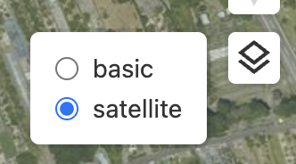

# maplibre-gl-layer

A layer control for [MapLibre GL JS](https://maplibre.org/maplibre-gl-js/docs/).



## Installation

```sh
npm install maplibre-gl-layer
```

## Usage

```js
import { Map } from "maplibre-gl";
import "maplibre-gl/dist/maplibre-gl.css";
import { LayerControl } from "maplibre-gl-layer";
import 'maplibre-gl-layer/style.css'

const map = new Map({ /* YOUR_MAP_OPTIONS */ });

map.addControl(new LayerControl({
  /**
   * type Layer = {
   *   name: string
   *   style: string | StyleSpecification
   *   checked?: boolean
   * }
   */
  layers: [
    {
      name: 'STYLE 1',
      style: YOUR_AWESOME_STYLE
    },
    {
      name: 'STYLE 2',
      style: YOUR_AWESOME_STYLE
    }
  ]
}))
```

## License

This project is licensed under the terms of the [MIT license](./LICENSE).
